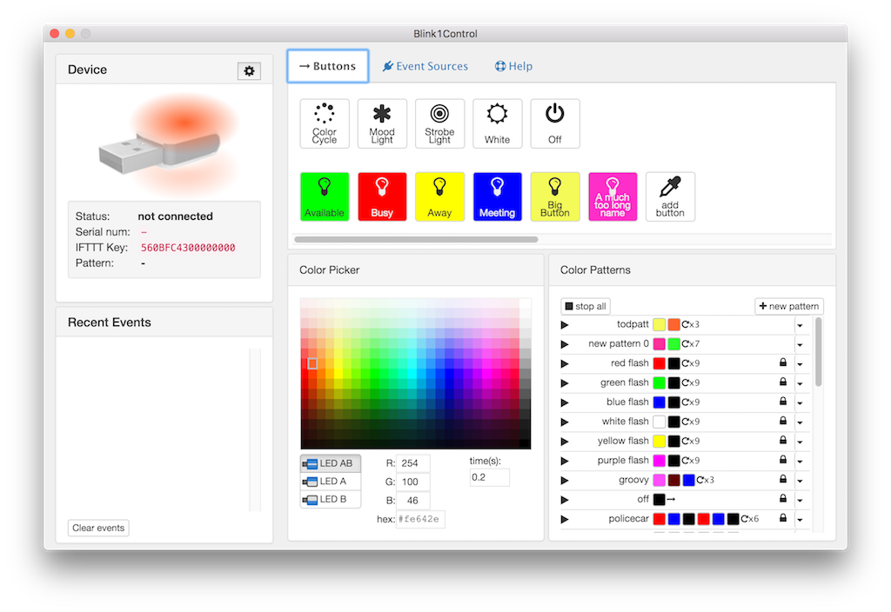
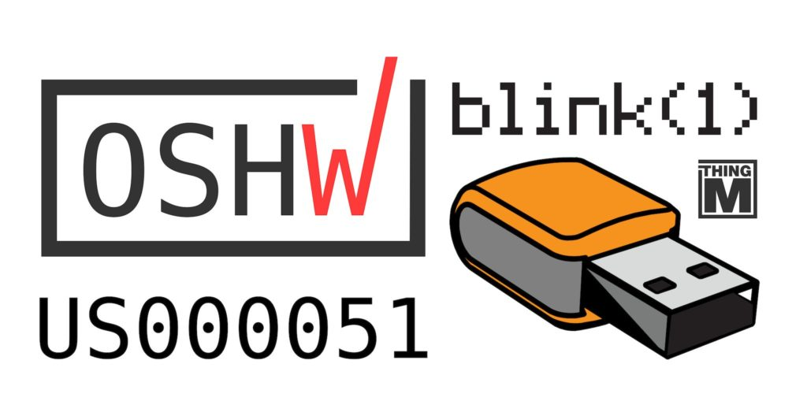

blink(1) USB RGB LED
====================

"[blink(1)](https://blink1.thingm.com/) is a super status light:
it packs three dimensions of information
(color, brightness and pattern) into a single tiny package that fits into
any USB port on nearly every device. It makes it incredibly easy to connect
any data source in the cloud or on your computer to a full-color RGB LED so
you can know what's happening without checking any windows, going to any
websites or typing any commands." - Get a blink(1) at https://buy.thingm.com/

The official repositories for blink(1) software are:

| repository | description |
| ---------- | ----------- |
| [Blink1Control2](https://github.com/todbot/Blink1Control2) | Graphical app for Mac / Windows / Linux |
| [blink1-tool](https://github.com/todbot/blink1-tool) | Command-line tool & C-library for all platforms |
| [blink1-java](https://github.com/todbot/blink1-java) | Java and Processing library |
| [blink1-python](https://github.com/todbot/blink1-python) | Python library |
| [node-blink1](https://github.com/sandeepmistry/node-blink1) | Node.js library |
| [blink1](https://github.com/todbot/blink1) | Hardware/firmware design, misc docs & notes (this repo) |

See below for descriptions of each, including APIs for languages not mentioned.

This repo used to house all blink(1)-related code, but is now a clearinghouse and links to official and supported blink(1) repositories.

## Blink1Control2 ##

[Blink1Control2](https://github.com/todbot/Blink1Control2) is an application for controlling and hooking events to blink(1). It is the primary user-level application for controlling blink(1).
It is an event-based system for triggering blink(1) color patterns.
Those events can be on your computer or on the Net.

Blink1Control2 can receive events from:
- [IFTTT](https://ifttt.com/channels)'s many channels
- IMAP/GMAIL email services
- Skype events
- URLs containing text or JSON
- Local files or executed scripts

Blink1Control2 has its own repository. More information at:
https://github.com/todbot/Blink1Control2

#### Download Blink1Control2 ####
- Mac OS X: https://github.com/todbot/Blink1Control2/releases
- Windows: https://github.com/todbot/Blink1Control2/releases

## blink1-tool ##

`blink1-tool` is a C-based command-line for script-writers, programmers and hackers. It lives in the repo: https://github.com/todbot/blink1-tool

- **blink1-tool** -- command-line program for use in your own scripts.
  - Download for:
[Mac OSX](https://thingm.com/blink1-tool/releases) /
[Windows](https://thingm.com/blink1-tool/releases) /
[Linux](https://thingm.com/blink1-tool/releases) /
[RaspberryP)](https://thingm.com/blink1-tool/releases)

## What is in this repo ##

- __docs__             -- Documentation of APIs and tips & tricks
- __java__             -- Java / Processing library info
- __processing__       -- Processing applications  (https://processing.org)
- __nodejs__           -- NodeJs library info
- __python__           -- Python libraries (there are a couple to choose from)
- __ruby__             -- Ruby APIs & Ruby Tools
- __go__               -- Go library
- __qt__               -- old Blink1Control1 Qt app
- __mac__              -- Mac OS X details and old Blink1Control0 app
  - scripts      -- command-line scripts to do cool things
- __windows__          -- Windows details and old Blink1Control0 app
  - Blink1Lib     -- .NET library wrapping blink1-lib
  - ManagedBlink1 -- 100% .NET library
  - scripts  -- Windows command-line scripts to do cool things
- __linux__            -- Linux details and scripts
  - contrib__    -- contributed Linux scripts
- __chrome__           -- ChromeOS info
- __hardware__         -- all hardware-related info (firmware & schematic & enclosure)

Some docs that might be useful
------------------------------

- [blink1-tool](https://github.com/todbot/blink1/blob/master/docs/blink1-tool.md)
- [app-url-api-examples](https://github.com/todbot/blink1/blob/master/docs/app-url-api-examples.md)
- [app-url-api](https://github.com/todbot/blink1/blob/master/docs/app-url-api.md)

Also see the [wiki pages](https://github.com/todbot/blink1/wiki/_pages)

# Copyright and License

blink(1) is open source hardware OSHW US000051

Copyright (c) ThingM, 2012-2018

'blink(1)' is a trademark of ThingM Corporation

License: CC BY-SA 3.0
https://creativecommons.org/licenses/by-sa/3.0/
